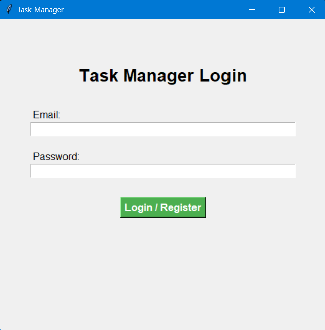
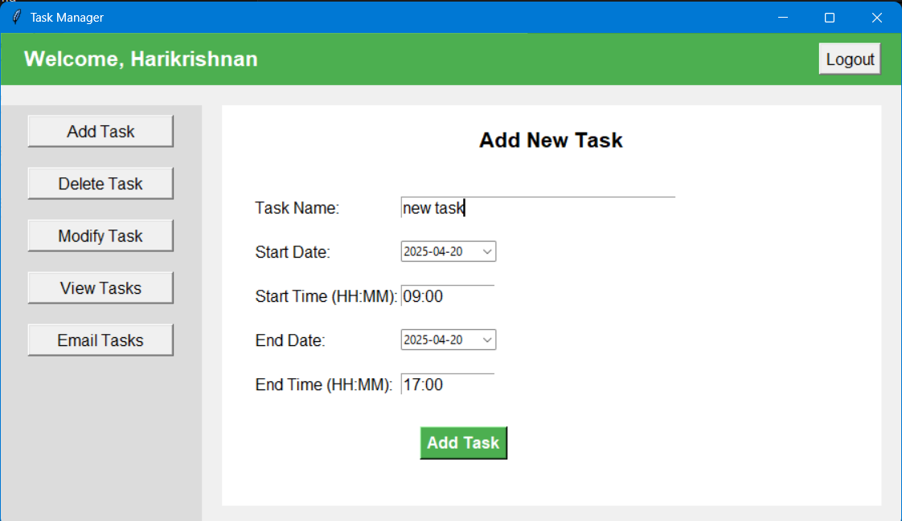
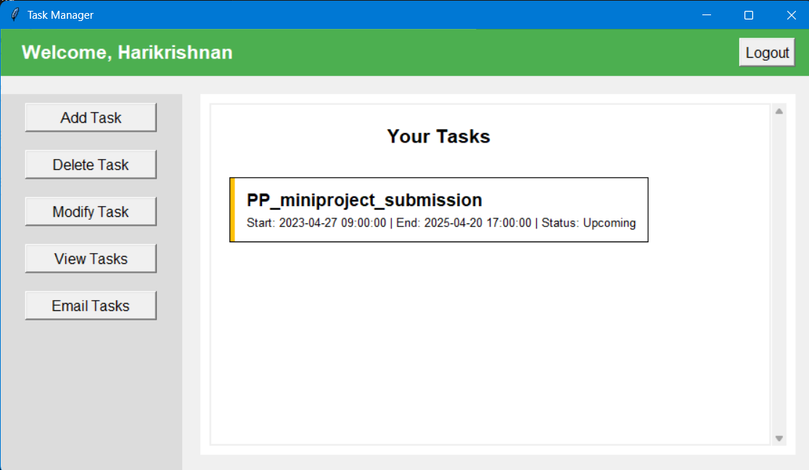
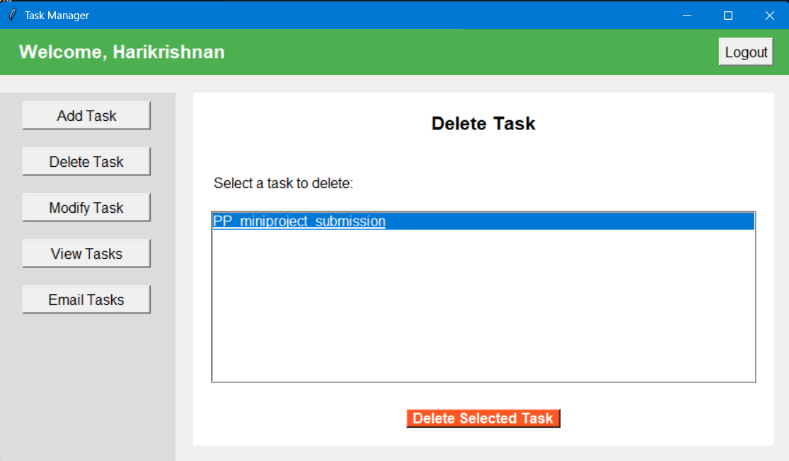

# Task Manager GUI Application

## Overview

The Task Manager GUI Application is a user-friendly desktop tool that allows users to manage their tasks efficiently through an intuitive graphical interface. This application transforms the original command-line task manager into a modern, easy-to-use GUI application while maintaining all the core functionality.

Users can:
- Register and login using their email and password
- Add, delete, modify, and view tasks with a few clicks
- Email their task list to themselves
- Track task details including start date/time, end date/time, and status

This project uses `pandas` for data management, `tkinter` for the GUI interface, `tkcalendar` for date selection, `smtplib` for email functionality, and regular expressions for input validation.

**Login/Registration Page**




**Add Task**




**View Tasks**



**Delete Task**




## Features

### 1. User-Friendly Interface
- **Modern GUI**: Clean, intuitive interface with a sidebar navigation system
- **Form-Based Inputs**: Easy-to-use forms replace command-line prompts
- **Visual Task Cards**: Tasks are displayed as visual cards with color-coded status indicators
- **Calendar Widget**: Date selection via an interactive calendar widget

### 2. User Authentication
- **Registration Form**: New users can register with email, password, and name
- **Login System**: Returning users can easily log in with their credentials
- **Validation**: Real-time validation of email formats and password correctness

### 3. Task Management
- **Add Tasks**: Add new tasks through an intuitive form with date pickers
- **Delete Tasks**: Delete tasks through a visual selection interface
- **Modify Tasks**: Easy-to-use interface for modifying any aspect of existing tasks
- **View Tasks**: Tasks are displayed in a scrollable list with visual status indicators

### 4. Task Details
- Task name
- Start date and time
- End date and time
- Task status (Upcoming, Ongoing, or Completed)
- Visual status indicators (color-coded)

### 5. Email Functionality
- Email your complete task list to your registered email address
- Well-formatted email with all task details

## Requirements

To run the application, you need the following:

- Python 3.7+
- Required Python libraries:
  - `pandas` - for managing task and user data
  - `tkinter` - for the GUI interface (included with standard Python)
  - `tkcalendar` - for the date selection widget
  - `re` - for input validation using regular expressions
  - `datetime` - for date and time manipulation
  - `smtplib` - for sending emails

You can install the required libraries using pip:

```bash
pip install pandas tkcalendar
```

## File Structure

```bash
├── task_manager_gui.py    # Main GUI application code
├── task_manager.py
├── users.csv              # CSV file to store user data
├── task_manager.csv       # CSV file to store task data
├── README.md              # This README file
└── screenshots/           # Optional folder containing application screenshots
```

## Installation and Setup

1. **Clone or download** the repository to your local machine.

2. **Install required dependencies**:
   ```bash
   pip install pandas tkcalendar
   ```

3. **Run the application**:
   ```bash
   python task_manager_gui.py
   ```

## How to Use

### 1. Launch the Application
Run the script to open the Task Manager GUI:
```bash
python task_manager_gui.py
```

### 2. User Registration/Login
- **First-time users**: Enter your email address, and the application will prompt you to complete registration by providing your name and password.
- **Returning users**: Enter your registered email and password to log in.

### 3. Dashboard Navigation
After logging in, you'll see the main dashboard with a sidebar containing the following options:
- **Add Task**: Create a new task
- **Delete Task**: Remove an existing task
- **Modify Task**: Change details of an existing task
- **View Tasks**: Display all your tasks
- **Email Tasks**: Send your task list to your email

### 4. Adding a Task
1. Click on "Add Task" in the sidebar
2. Fill in the task details:
   - Task Name
   - Start Date (select from calendar)
   - Start Time (HH:MM format)
   - End Date (select from calendar)
   - End Time (HH:MM format)
3. Click "Add Task" to save

### 5. Deleting a Task
1. Click on "Delete Task" in the sidebar
2. Select the task you want to delete from the list
3. Click "Delete Selected Task"
4. Confirm the deletion when prompted

### 6. Modifying a Task
1. Click on "Modify Task" in the sidebar
2. Follow the three-step process:
   - Select the task to modify
   - Choose what aspect to modify (name, dates, times, or status)
   - Enter the new value
3. Click "Apply Changes" to save

### 7. Viewing Tasks
1. Click on "View Tasks" in the sidebar
2. Browse through your tasks in the scrollable list
3. Tasks are color-coded by status:
   - Yellow: Upcoming
   - Blue: Ongoing
   - Green: Completed

### 8. Emailing Tasks
1. Click on "Email Tasks" in the sidebar
2. The application will automatically send your tasks to your registered email address
3. A confirmation message will appear when the email is sent successfully

### 9. Logging Out
Click the "Logout" button in the top-right corner of the dashboard to return to the login screen.

## Code Structure and Components

### Main Classes and Functions

#### `TaskManagerApp` Class
The primary class that manages the entire application. It initializes the GUI and handles all functionality.

#### Key Methods:
- `__init__(self, root)`: Initializes the application and loads data
- `create_login_frame(self)`: Creates the login/registration interface
- `process_login(self)`: Handles user authentication and registration
- `show_task_dashboard(self)`: Displays the main dashboard after login
- `show_add_task(self)`, `show_delete_task(self)`, `show_modify_task(self)`, `show_view_tasks(self)`: Methods for each task management screen
- `process_add_task(self, ...)`, `process_delete_task(self, ...)`, `process_modify_task(self, ...)`: Methods that handle the actual data operations
- `email_tasks(self)`: Sends the task list via email

### GUI Components

1. **Frames**:
   - `login_frame`: Login and registration
   - `dashboard_frame`: Main application frame
   - `sidebar_frame`: Navigation sidebar
   - `content_frame`: Main content area that changes based on selected action

2. **Widgets**:
   - Entry fields for text input
   - DateEntry widgets from tkcalendar for date selection
   - Buttons for actions
   - Labels for displaying information
   - Listboxes for selecting tasks
   - Radiobuttons for options
   - Scrollable canvas for task list

3. **Dynamic Content**:
   The application dynamically updates the content frame based on user actions without reloading the entire interface.

## Data Management

### CSV Files
The application uses two CSV files to store data:

1. **users.csv**: Stores user information
   ```csv
   user_email,user_password,user_name
   example@example.com,secretpassword,John Doe
   ```

2. **task_manager.csv**: Stores task details
   ```csv
   user_email,task_name,task_start_date,task_start_time,task_end_date,task_end_time,task_status
   example@example.com,Task 1,2025-01-05,09:00:00,2025-01-05,11:00:00,Upcoming
   ```

### Data Handling
- **pandas DataFrames**: All data is loaded into pandas DataFrames for efficient manipulation
- **Real-time Updates**: Changes are immediately saved to CSV files
- **User-specific Data**: Tasks are filtered by user email to ensure each user only sees their own tasks

## Input Validation

The application includes thorough validation for all inputs:

- **Email Format**: Validates email addresses using regular expressions
- **Required Fields**: Ensures all required fields are completed
- **Time Format**: Ensures times are entered in HH:MM format
- **Confirmation Dialogs**: Confirms potentially destructive actions like deletion

## Email Functionality

The application can send emails with the complete task list:

1. **SMTP Connection**: Establishes a connection to the Gmail SMTP server
2. **Authentication**: Uses the application's email credentials
3. **Email Construction**: Creates a formatted email with all task details
4. **Delivery**: Sends the email to the user's registered email address

## Customization

You can customize the application in several ways:

1. **Appearance**: Modify colors, fonts, and layout in the code
2. **Email Settings**: Update the email sender credentials in the `email_tasks` method
3. **Field Validations**: Adjust validation rules in the respective processing methods

## Troubleshooting

### Common Issues and Solutions

1. **Application won't start**:
   - Ensure Python 3.7+ is installed
   - Verify all required libraries are installed
   - Check for syntax errors if you've modified the code

2. **Login issues**:
   - Make sure users.csv exists and has the correct format
   - Check if the email and password match exactly (case-sensitive)

3. **Email sending fails**:
   - Ensure you have internet connectivity
   - Check if the sender email and password are correct
   - Some email providers may block login attempts from applications

4. **Date/Time issues**:
   - Make sure dates are valid
   - Times must be in 24-hour format (HH:MM)

## Future Enhancements

Potential improvements for future versions:

1. **Task Categories/Tags**: Ability to categorize tasks
2. **Search Functionality**: Search for specific tasks
3. **Task Sorting**: Sort tasks by date, status, etc.
4. **Dark Mode**: Add a dark mode option
5. **Task Notifications**: Set up desktop notifications for upcoming tasks
6. **Data Encryption**: Enhanced security for user data
7. **Task Dependencies**: Set up dependencies between tasks
8. **User Preferences**: Customizable settings for individual users
